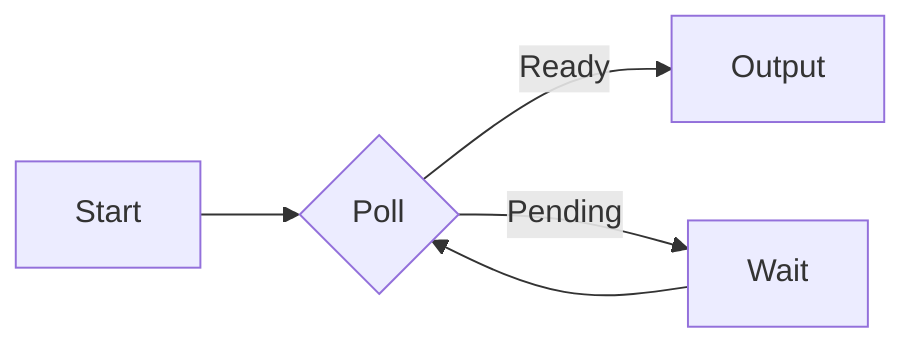
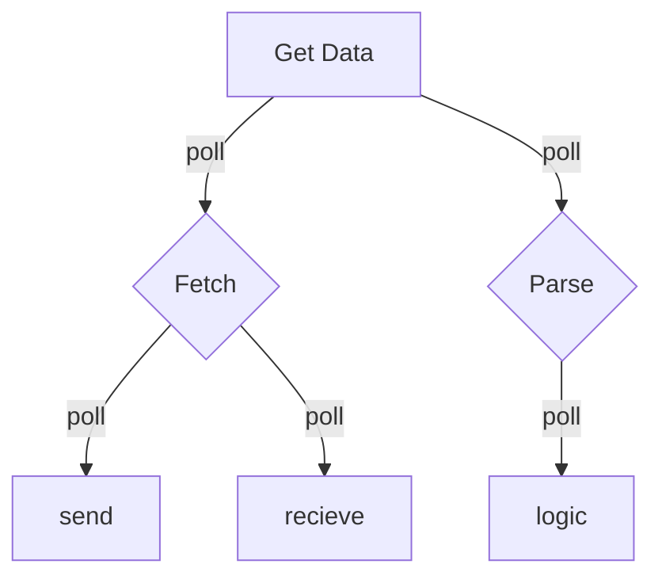

# Embedded Rust for Real-Time Systems
By Albert Werner Laursen

---

## Agenda
1. State of RTOS in Rust
2. Embassy vs. RTIC
3. Async/Await
4. Examples

---
## What is an RTOS?

- What is an Operating System?
+ General Purpose OS vs. RTOS
+ Traditional RTOS
+ How does Rust fit in?

---
## State of RTOS in Rust

- No real RTOS in Rust
+ [arewertosyet.com](https://arewertosyet.com)
  - No...
+ So what do we do?
  - Asynchronous Execution
  - "pseudo" threading

---
## Embassy

- [embassy.dev](https://embassy.dev)
- Full framework for async programming
  - Batteries included
  - HAL, drivers, timing, etc.

---
## RTIC

- [rtic.rs](https://rtic.rs)
- Real-Time Interrupt-driven Concurrency
  - "Bring your own HAL"
  - [Stack Resource Policy (SRP)](https://link.springer.com/article/10.1007/BF00365393)
  - preemptive deadlock and race-free scheduling

---
## Async/Await

- Read the [Async Book](https://rust-lang.github.io/async-book/)
- Rust core feature
- Asynchronous interface
  - `async fn` and `await`
  - compatible with any executor

---

`async fn` is syntactic sugar
    
```rust
async fn foo() -> u32 {
    42
}

fn foo() -> impl Future<Output = u32> {
    async { 42 }
}
```

---

So what is a Future?

```rust
trait Future {
    type Output;
    fn poll(self: Pin<&mut Self>, cx: &mut Context<'_>) -> Poll<Self::Output>;
}

enum Poll<T> {
    Ready(T),
    Pending,
}
```

---
A Future is a state machine



---

async/await is an ergonomic way to work with Futures

```rust
async fn get_data() -> Result<Data, Error> {
    let response = fetch("https://example.com/data").await?;
    let data = parse(response).await?;
    Ok(data)
}
```

---

Nested Futures are tree like state machines



---

